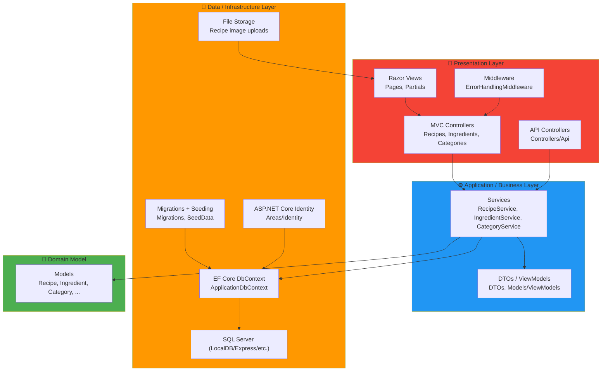

# Recipe World

Recipe World is an ASP.NET Core MVC (.NET 8) web app for creating, managing, and discovering recipes. It includes authentication/authorization, admin approval workflows, ingredient tracking, image support, and a small Swagger-documented API.

## Why this project is interesting

- Role-based auth with ASP.NET Core Identity (admin vs regular users)
- EF Core migrations + seeding (ready-to-run dev database)
- Service layer (separates controllers from business logic)
- Recipe workflow statuses (Draft/Public/Private/Pending)
- Image support (upload to disk or use image URLs)

## Features

- User authentication & authorization (Identity + roles)
- Recipe CRUD + status workflow
- Ingredients database + linking ingredients to recipes (amounts/units)
- Admin approval system for new ingredients
- Search/filter + pagination
- Responsive UI (Razor Views + Bootstrap)

## Tech Stack

- ASP.NET Core MVC (.NET 8)
- SQL Server + Entity Framework Core
- ASP.NET Core Identity
- Razor Views + Bootstrap
- Swagger/OpenAPI (development)

## Architecture



Note: GitHub renders Mermaid diagrams automatically. If you don't see the diagram, make sure your Markdown viewer supports Mermaid.

## Quick Start (Local)

### Prerequisites

- .NET 8 SDK: https://dotnet.microsoft.com/download/dotnet/8.0
- SQL Server (LocalDB/Express/full): https://www.microsoft.com/sql-server/sql-server-downloads

### 1) Clone

```bash
git clone <your-repository-url>
cd RecipeWorld
```

### 2) Configure database

Edit `src/worldRecipeMvc/appsettings.json` and set `ConnectionStrings:RecipeWorldConnectionString`.

Example (LocalDB):

```json
{
  "ConnectionStrings": {
    "RecipeWorldConnectionString": "Server=(localdb)\\mssqllocaldb;Database=RecipeWorldDB;Trusted_Connection=True;MultipleActiveResultSets=true"
  }
}
```

### 3) Apply migrations + seed data

From the app project folder:

```bash
cd src/worldRecipeMvc
dotnet ef database update
```

If `dotnet ef` isn’t available, install the tool:

```bash
dotnet tool install --global dotnet-ef
```

### 4) (Optional) Configure image uploads

Uploads are stored on disk and served at `/images/recipes/*`.

Set `ImageUpload:StoragePath` in `src/worldRecipeMvc/appsettings.json` to a folder that exists on your machine, for example:

```json
{
  "ImageUpload": {
    "StoragePath": "C:\\PATH\\TO\\RecipeWorld\\img\\worldRecipeMvc\\wwwroot\\images\\recipes"
  }
}
```

### 5) Run

```bash
dotnet run --project src/worldRecipeMvc/worldRecipeMvc.csproj
```

In Development, Swagger is available at `/swagger`.

## Demo Accounts

- Regular user: `demo@recipeworld.com` / `Demo123!`
- Admin user: `admin@recipeworld.com` / `Admin123!`

Change these credentials in production.

## Tests

```bash
dotnet test src/worldRecipeMvc.Tests/worldRecipeMvc.Tests.csproj
```

## Project Structure (high level)

```
RecipeWorld/
    worldRecipeMvc/             # ASP.NET Core MVC app
      Areas/
        Identity/
      Controllers/
        Api/
      Data/
        Migrations/
      DTOs/
      Middleware/
      Models/
        ViewModels/
      Services/
      Views/
      wwwroot/
    worldRecipeMvc.Tests/        # Test project
      Services/
    worldRecipeMvc.Tests/       # Test project
  img/                          # Static image assets used by the app
  sql/                          # SQL scripts (optional utilities)
```

## Troubleshooting

### Database connection errors

- Ensure SQL Server is running
- Verify `RecipeWorldConnectionString` points to a reachable SQL Server instance

Reset the database (destructive):

```bash
cd src/worldRecipeMvc
dotnet ef database drop
dotnet ef database update
```

### Email confirmation in development

If `RequireConfirmedAccount = true` is enabled, use the seeded demo accounts or configure an email sender.

## Contact

- GitHub: https://github.com/MatheusFerraro
- LinkedIn: https://www.linkedin.com/in/mcamiloferraro/
- Email: mailto:matheus.ferraro@gmail.com
