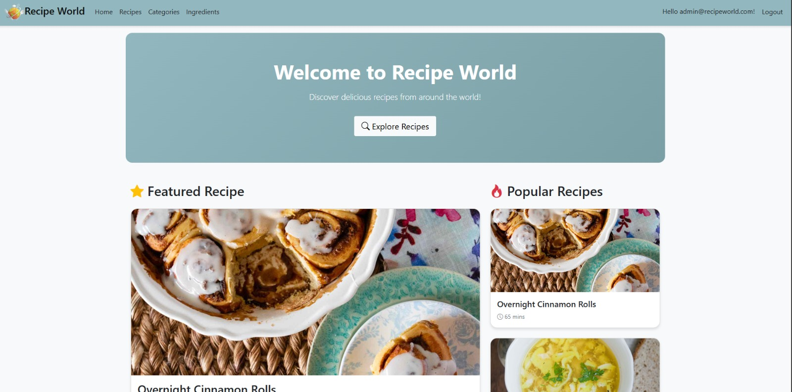
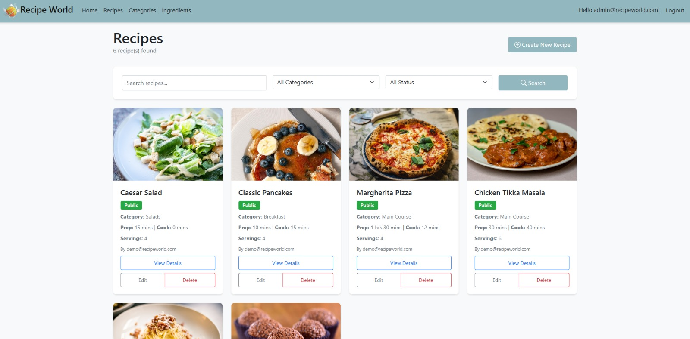
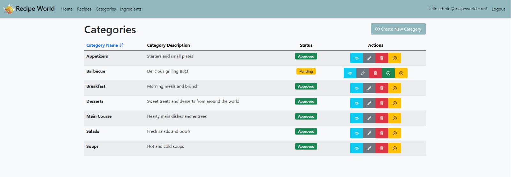
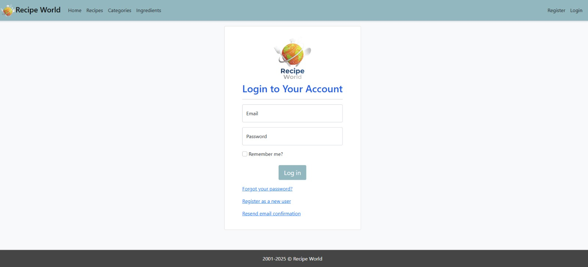
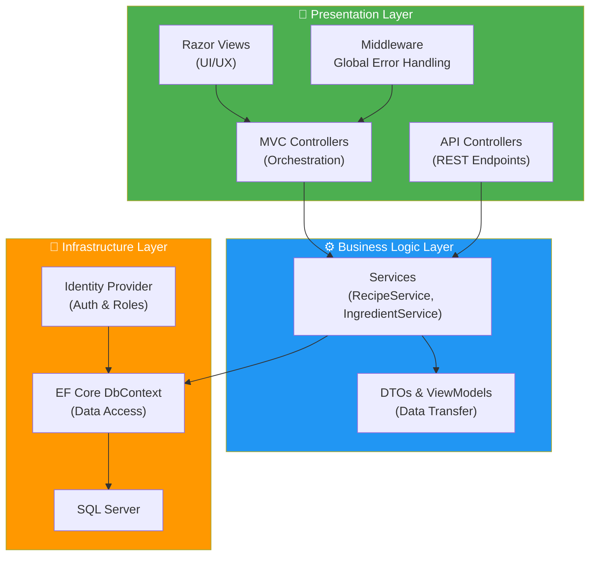

# 🍳 Recipe World

    

**Recipe World** is a full-stack web application designed to demonstrate enterprise-level software development practices using **ASP.NET Core MVC (.NET 8)**.

This project was built to showcase proficiency in **N-Tier Architecture**, **Secure Authentication**, **Database Management**, and **Unit Testing**. It features a complete recipe management ecosystem with role-based security, ingredient tracking, and an admin approval workflow.

---

## 📸 Screenshots

<p align="center">
  
</p>

<table>
  <tr>
    <td>
      
    </td>
    <td>
      
    </td>
  </tr>
  <tr>
    <td>
      
    </td>
    <td>
      
    </td>
  </tr>
</table>

---

## 🚀 Why This Project Matters (Technical Highlights)


* **Clean Architecture:** Implements a Service Layer pattern to decouple Controllers from Business Logic and Data Access, ensuring maintainability and testability.
* **Identity & Security:** Rigorous implementation of **ASP.NET Core Identity** with Role-Based Access Control (RBAC) to differentiate between Administrators and Standard Users.
* **Database Engineering:** Utilizes **Entity Framework Core** with a Code-First approach, including complex relationships (Many-to-Many for Recipes-Ingredients), lazy loading proxies, and robust seeding strategies.
* **Quality Assurance:** Includes a test project (`worldRecipeMvc.Tests`) utilizing **xUnit** and **Moq** to verify business logic isolation using an In-Memory database.
* **Hybrid Interface:** Features both a traditional MVC frontend and a Swagger-documented API layer, demonstrating versatility in handling different client types.

---

## 🛠️ Tech Stack

| Category | Technologies |
| :--- | :--- |
| **Framework** | .NET 8, ASP.NET Core MVC |
| **Data Access** | Entity Framework Core (SQL Server), LINQ |
| **Authentication** | ASP.NET Core Identity (Cookies & JWT Support) |
| **Frontend** | Razor Views, Bootstrap 5, jQuery Validation, CSS3 |
| **Testing** | xUnit, Moq, EF Core In-Memory DB |
| **Tools** | Swagger/OpenAPI, Dependency Injection (DI), Git |

---

## 🏗️ Architecture

The solution follows a separation of concerns principle to ensure scalability:



## ✨ Key Features

### 👤 User Experience

- **Recipe management:** Users can create, read, update, and delete (CRUD) their own recipes.
- **Favorites:** Bookmark recipes with one click and revisit them on a personal **My Favorites** page.
- **Ratings & reviews:** 1–5 star reviews with comments; averages shown on cards and detail pages.
- **Trending home page:** Top-rated and most-favorited recipes, served from an in-memory cache.
- **Smart search & pagination:** Search and windowed pagination across recipes, categories, and ingredients.
- **Image handling:** Uploads validated by extension, size, and file signature (magic bytes).

### 🛡️ Admin & Security

- **Approval workflows:** New ingredients and categories enter a **Pending** state and require admin approval.
- **Role management:** Distinct capabilities for **Admin** vs **User** roles, enforced in the service layer.
- **Rate limiting:** Per-IP global limits plus a strict policy on the login endpoint (HTTP 429).
- **Configurable seeding:** Demo/admin account passwords come from configuration — no credentials in source.

### 🧪 API & Testing

- **REST API with JWT:** `POST /api/auth/login` issues Bearer tokens; endpoints documented in Swagger UI.
- **Result pattern:** Services return FluentResults `Result<T>` mapped to proper HTTP codes (400/403/404/409).
- **Testing:** 90 tests — xUnit service tests (EF Core In-Memory) plus full integration tests
  (`WebApplicationFactory` + SQLite in-memory) covering auth, rate limiting, and the API surface.
- **Observability:** Serilog structured logging and a `/health` endpoint.

## 🗂️ Project Structure

High-level overview of where to find things:

- `src/worldRecipeMvc/` — main ASP.NET Core MVC application
  - `Controllers/` — MVC controllers and `Controllers/Api/` REST endpoints
  - `DTOs/` — DTOs used by the API layer
  - `Services/` — business logic (service layer)
  - `Data/` — EF Core DbContext, migrations, seeding
  - `Models/` — domain entities and `Models/ViewModels/` used by views
  - `Middleware/` — custom middleware (global error handling)
  - `Views/` — Razor views
  - `wwwroot/` — static assets (CSS/JS/images)
- `src/worldRecipeMvc.Tests/` — xUnit test project (service-level tests)
- `img/worldRecipeMvc/wwwroot/images/recipes/` — image storage folder used for uploads
- `sql/` — optional SQL scripts/utilities

## 💻 Getting Started

### Prerequisites

- .NET 8 SDK
- SQL Server Express or LocalDB

### Installation

1) Clone the repository

```bash
git clone https://github.com/MatheusFerraro/RecipeWorld.git
cd RecipeWorld
```

2) Configure database

Update the connection string in `src/worldRecipeMvc/appsettings.json` if you are not using a local SQL Server:

```json
{
  "ConnectionStrings": {
    "RecipeWorldConnectionString": "Server=(local);Database=WorldRecipeDb;Trusted_Connection=True;MultipleActiveResultSets=true;Encrypt=false"
  }
}
```

3) Run the application (migrations and sample data are applied automatically at startup)

```bash
dotnet run --project src/worldRecipeMvc
```

### Access the app

- Web UI: https://localhost:7008 (port may vary)
- Swagger API: https://localhost:7008/swagger
- Health check: https://localhost:7008/health

Demo accounts (Development): `demo@recipeworld.com` / `Demo123!` and `admin@recipeworld.com` / `Admin123!`
(configured in `appsettings.Development.json` under `SeedData`).

### 🐳 Run with Docker

The compose stack includes the app and a SQL Server 2022 container, with named volumes
for database data and uploaded images:

```bash
cp .env.example .env    # set MSSQL_SA_PASSWORD and JWT_KEY
docker compose up --build
```

Then open http://localhost:8080 — see [README.Docker.md](README.Docker.md) for details.

### 🔑 Using the API

```bash
# 1. Get a token
curl -X POST http://localhost:8080/api/auth/login \
     -H "Content-Type: application/json" \
     -d '{"email":"demo@recipeworld.com","password":"Demo123!"}'

# 2. Call authenticated endpoints with the Bearer token
curl -X POST http://localhost:8080/api/RecipesApi \
     -H "Authorization: Bearer <token>" \
     -H "Content-Type: application/json" \
     -d '{"recipeName":"My Recipe","instructions":"1. Cook."}'
```

## 🧪 Running Tests

```bash
dotnet test worldRecipeMvc.sln
```

90 tests: service-level unit tests (xUnit + EF Core In-Memory) and end-to-end integration
tests (`WebApplicationFactory` over SQLite in-memory) covering the API, JWT auth, rate limiting,
and MVC smoke paths.

## 📄 License

MIT — see [LICENSE](LICENSE).

## 📬 Contact

I am currently looking for internship or junior developer opportunities.

- LinkedIn: https://www.linkedin.com/in/mcamiloferraro/
- Email: mailto:matheus.ferraro@gmail.com