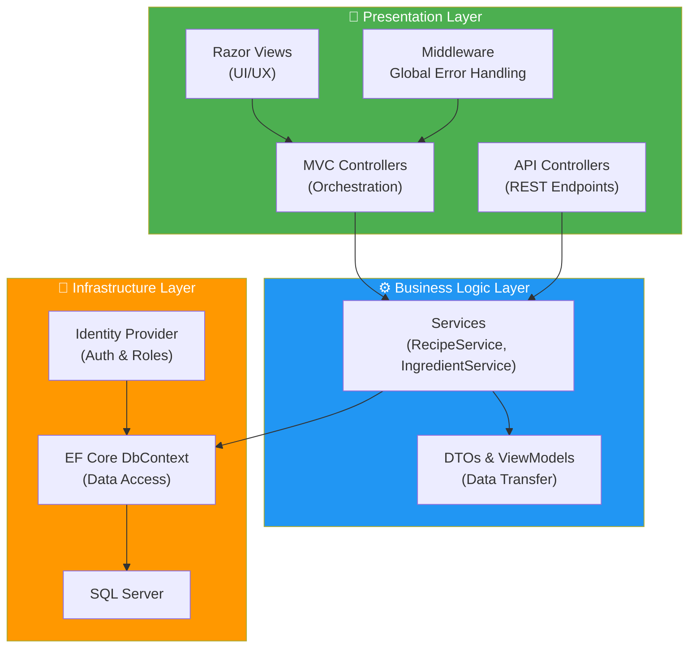

# 🍳 Recipe World

    

**Recipe World** is a full-stack web application designed to demonstrate enterprise-level software development practices using **ASP.NET Core MVC (.NET 8)**.

This project was built to showcase proficiency in **N-Tier Architecture**, **Secure Authentication**, **Database Management**, and **Unit Testing**. It features a complete recipe management ecosystem with role-based security, ingredient tracking, and an admin approval workflow.

---

## 🚀 Why This Project Matters (Technical Highlights)


* **Clean Architecture:** Implements a Service Layer pattern to decouple Controllers from Business Logic and Data Access, ensuring maintainability and testability.
* **Identity & Security:** Rigorous implementation of **ASP.NET Core Identity** with Role-Based Access Control (RBAC) to differentiate between Administrators and Standard Users.
* **Database Engineering:** Utilizes **Entity Framework Core** with a Code-First approach, including complex relationships (Many-to-Many for Recipes-Ingredients), lazy loading proxies, and robust seeding strategies.
* **Quality Assurance:** Includes a test project (`worldRecipeMvc.Tests`) utilizing **xUnit** and **Moq** to verify business logic isolation using an In-Memory database.
* **Hybrid Interface:** Features both a traditional MVC frontend and a Swagger-documented API layer, demonstrating versatility in handling different client types.

---

## 🛠️ Tech Stack

| Category | Technologies |
| :--- | :--- |
| **Framework** | .NET 8, ASP.NET Core MVC |
| **Data Access** | Entity Framework Core (SQL Server), LINQ |
| **Authentication** | ASP.NET Core Identity (Cookies & JWT Support) |
| **Frontend** | Razor Views, Bootstrap 5, jQuery Validation, CSS3 |
| **Testing** | xUnit, Moq, EF Core In-Memory DB |
| **Tools** | Swagger/OpenAPI, Dependency Injection (DI), Git |

---

## 🏗️ Architecture

The solution follows a separation of concerns principle to ensure scalability:



## ✨ Key Features

### 👤 User Experience

- **Recipe management:** Users can create, read, update, and delete (CRUD) their own recipes.
- **Smart search:** Filter by category, ingredient, or status using LINQ queries.
- **Image handling:** File uploads with validation and storage on disk.
- **Interactive UI:** Responsive layout with Bootstrap and client-side validation feedback.

### 🛡️ Admin & Security

- **Approval workflows:** New ingredients and categories enter a **Pending** state and require admin approval.
- **Role management:** Distinct capabilities for **Admin** vs **User** roles.
- **Secure seeding:** Seeds default roles and an admin account for fast local setup.

### 🧪 API & Testing

- **REST API:** Exposes endpoints (documented in Swagger UI during development).
- **Unit testing:** Service-level tests with xUnit + Moq + EF Core In-Memory.

## 🗂️ Project Structure

High-level overview of where to find things:

- `src/worldRecipeMvc/` — main ASP.NET Core MVC application
  - `Controllers/` — MVC controllers and `Controllers/Api/` REST endpoints
  - `DTOs/` — DTOs used by the API layer
  - `Services/` — business logic (service layer)
  - `Data/` — EF Core DbContext, migrations, seeding
  - `Models/` — domain entities and `Models/ViewModels/` used by views
  - `Middleware/` — custom middleware (global error handling)
  - `Views/` — Razor views
  - `wwwroot/` — static assets (CSS/JS/images)
- `src/worldRecipeMvc.Tests/` — xUnit test project (service-level tests)
- `img/worldRecipeMvc/wwwroot/images/recipes/` — image storage folder used for uploads
- `sql/` — optional SQL scripts/utilities

## 💻 Getting Started

### Prerequisites

- .NET 8 SDK
- SQL Server Express or LocalDB

### Installation

1) Clone the repository

```bash
git clone https://github.com/MatheusFerraro/RecipeWorld.git
cd RecipeWorld
```

2) Configure database

Update the connection string in `src/worldRecipeMvc/appsettings.json` if you are not using LocalDB:

```json
{
  "ConnectionStrings": {
    "RecipeWorldConnectionString": "Server=(localdb)\\mssqllocaldb;Database=RecipeWorldDB;Trusted_Connection=True;MultipleActiveResultSets=true"
  }
}
```

3) Apply migrations

```bash
cd src/worldRecipeMvc
dotnet ef database update
```

4) Run the application

```bash
dotnet run
```

### Access the app

- Web UI: https://localhost:7198 (port may vary)
- Swagger API: https://localhost:7198/swagger

## 🧪 Running Tests

```bash
dotnet test src/worldRecipeMvc.Tests/worldRecipeMvc.Tests.csproj
```

## 📄 License

MIT — see [LICENSE](LICENSE).

## 📬 Contact

I am currently looking for internship or junior developer opportunities.

- LinkedIn: https://www.linkedin.com/in/mcamiloferraro/
- Email: mailto:matheus.ferraro@gmail.com